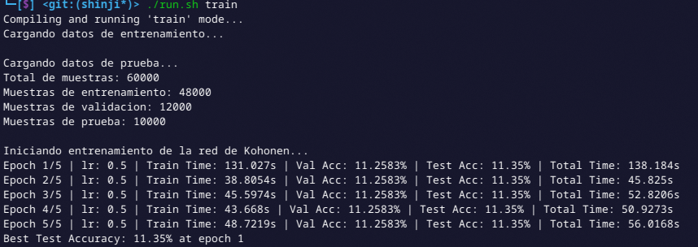
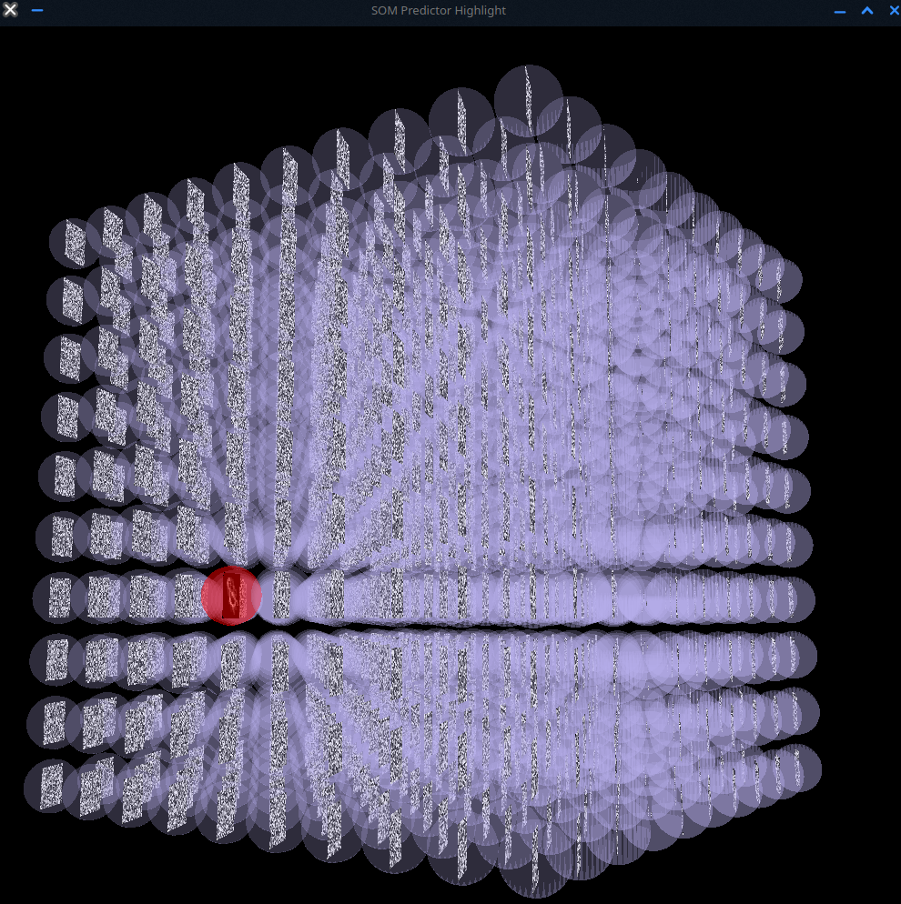
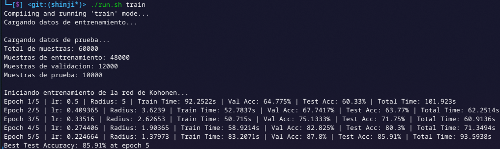
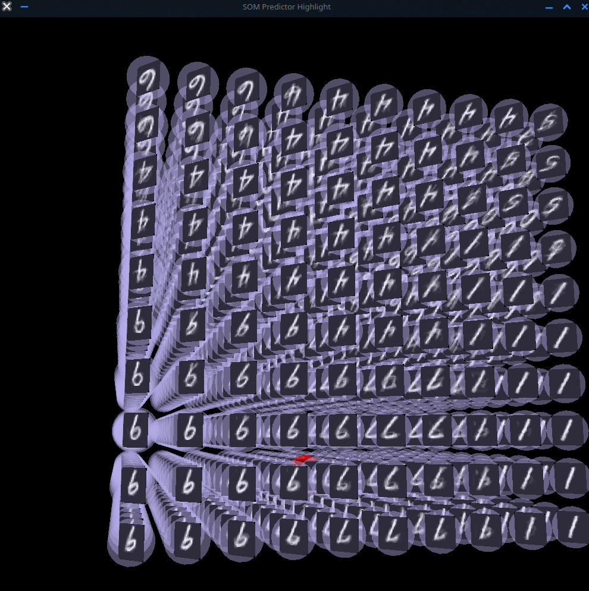
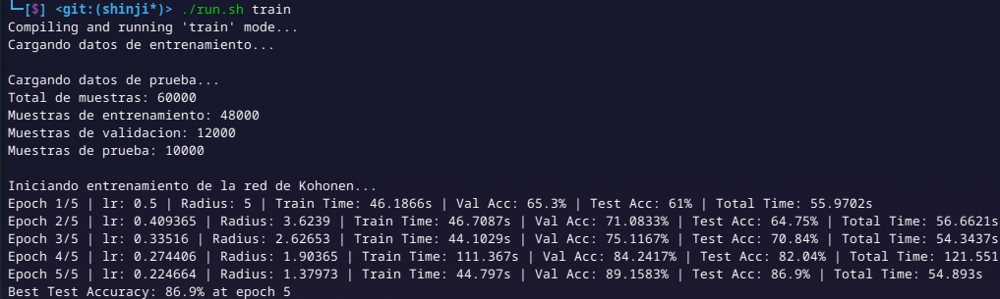
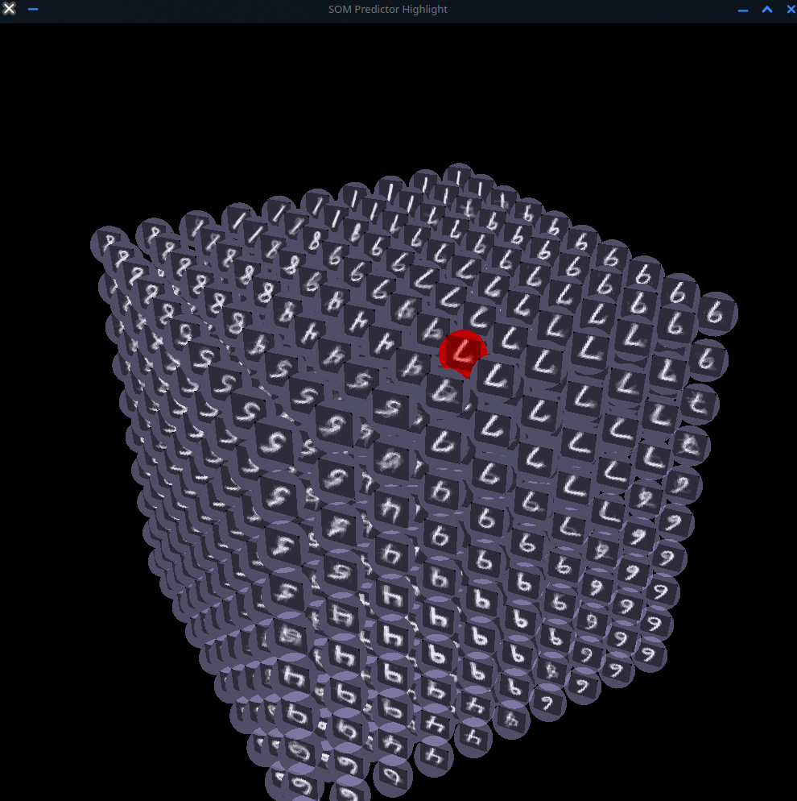

# Red Neuronal de Kohonen

<p align="center">
    
</p>

Este proyecto implementa una **Red Neuronal de Kohonen** (también conocida como **Mapa Autoorganizado** o **SOM - Self-Organizing Map**) entrenada con el dataset MNIST para representar visualmente los patrones de dígitos manuscritos.
La red aprende a agrupar vectores de entrada similares en ubicaciones vecinas dentro de una cuadrícula bidimensional, permitiendo una representación topológica del conjunto de datos.

---

## ¿Cómo funciona una Red de Kohonen?

Una red de Kohonen consta de una capa de salida organizada en una malla (por ejemplo, 10x10) donde cada neurona representa un "peso" o prototipo que compite por activarse según la similitud con la entrada.
El entrenamiento se realiza de forma no supervisada a través de los siguientes pasos:

1. **Inicialización**: Los pesos de cada neurona se inicializan aleatoriamente.
2. **Competencia**: Por cada entrada, se determina la neurona ganadora (Best Matching Unit o **BMU**) cuya distancia al vector de entrada es mínima.
3. **Actualización**: La BMU y sus vecinas actualizan sus pesos para parecerse más al vector de entrada.
4. **Decaimiento**: La tasa de aprendizaje y el radio de vecindad disminuyen con el tiempo para estabilizar la red.

Las principales funciones utilizadas en la implementación incluyen:

- `calcularDistanciaEuclidiana`: calcula la distancia entre el vector de entrada y los pesos de cada neurona.
- `encontrarBMU`: identifica la neurona más cercana al vector de entrada.
- `actualizarPesos`: ajusta los pesos de la BMU y sus vecinos.
- `entrenarRed`: ejecuta múltiples épocas de entrenamiento con ejemplos del dataset.

---

## Requisitos

- g++
- make
- Dataset MNIST en formato binario (`.idx`)
- Sistema Unix-like

---

## 1. Convertir Dataset MNIST a CSV

Convierte el conjunto de datos MNIST desde su formato binario original (`.idx`) a archivos CSV legibles:

```bash
g++ ./convert.cpp -o convert && ./convert
```

Esto generará archivos `.csv` que contienen las imágenes y etiquetas para entrenamiento y prueba.

---

## 2. Ejecutar Entrenamiento de Red Kohonen

Este paso entrena la red neuronal con los datos convertidos:

```bash
./run.sh train
```

Durante el entrenamiento, los pesos de la red se ajustan gradualmente para formar agrupaciones de datos similares.

---

## 3. Ejecutar Visualización de la Red Kohonen

Una vez finalizado el entrenamiento, se puede visualizar la topología aprendida por la red:

```bash
./run.sh view
```

Esto genera una representación visual que muestra cómo la red ha agrupado los diferentes dígitos del MNIST en la cuadrícula.

## Salidas

### BMU ONLY





### CONSTANT RADIUS





### GAUSSIAN RADIUS





| Modo                | Época | Learning Rate | Radio   | Train Time | Val Accuracy | Test Accuracy      | Total Time |
| ------------------- | ----- | ------------- | ------- | ---------- | ------------ | ------------------ | ---------- |
| **BMU ONLY**        | 1     | 0.5           | —       | 131.027s   | 11.2583%     | 11.35%             | 138.184s   |
|                     | 5     | 0.5           | —       | 48.7219s   | 11.2583%     | 11.35%             | 56.0168s   |
|                     | Best  | —             | —       | —          | —            | **11.35% (Ep. 1)** | —          |
| **CONSTANT RADIUS** | 1     | 0.5           | 5       | 92.2522s   | 64.775%      | 60.33%             | 101.923s   |
|                     | 5     | 0.224664      | 1.37973 | 83.2071s   | 87.8%        | 85.91%             | 93.5938s   |
|                     | Best  | —             | —       | —          | —            | **85.91% (Ep. 5)** | —          |
| **GAUSSIAN RADIUS** | 1     | 0.5           | 5       | 46.1866s   | 65.3%        | 61%                | 55.9702s   |
|                     | 5     | 0.224664      | 1.37973 | 44.797s    | 89.1583%     | 86.9%              | 54.893s    |
|                     | Best  | —             | —       | —          | —            | **86.9% (Ep. 5)**  | —          |

## License

This project is licensed under the MIT License. See the [LICENSE](LICENSE) file for details.
